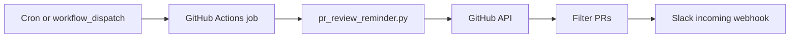

# PR review Slack reminder

Scheduled GitHub Actions workflow that posts concise Slack reminders for open pull requests
that need attention across one or more GitHub repositories.

## Monitored repositories

Set the repository **variable** `PR_REVIEW_REPOSITORIES` (comma-separated `owner/repo`).

| `PR_REVIEW_REPOSITORIES` | Behavior |
|--------------------------|----------|
| `acme/widget,acme/widget-fork` | Scan both repositories |
| *(empty or unset)* | Scan only the repository where the workflow runs (`GITHUB_REPOSITORY`) |

The token in `PR_REVIEW_GITHUB_TOKEN` must have **read** access to every listed repository.
`GITHUB_TOKEN` alone only sees the repository that hosts the workflow.

## How it works



On each run the script:

1. Lists **open, non-draft** pull requests in each configured repository.
2. **Skips** PRs that have ignore labels (`no-reminder`, `wip`) or snooze labels
   (`reminder-snooze`, `reminder-snooze-until:YYYY-MM-DD`).
3. Keeps PRs **idle** for at least `PR_REVIEW_IDLE_HOURS` (default `24`) since last update.
4. Includes PRs that still **need review** (requested reviewers, no approval yet, or
   `CHANGES_REQUESTED` waiting on the author).
5. Applies **user lists** from [`.github/pr-review-reminder.toml`](../../pr-review-reminder.toml)
   (exclude authors, optional team filter, Slack @mentions).
6. Posts one Slack message grouped by repository (title, link, author, idle time, who should act).

Scheduled runs post to Slack. Manual runs default to **dry run** (payload in Actions logs only).

## Team and exclude lists (edit in repo)

Edit **[`.github/pr-review-reminder.toml`](../../pr-review-reminder.toml)** — no secrets required.

| Key | Purpose |
|-----|---------|
| `exclude_users` | GitHub nicknames: skip PR when they are the **author**, or when **all** requested reviewers are on this list |
| `team_reviewers` | GitHub nicknames: only PRs involving at least one of these people (requested reviewer or person who should act). Empty `[]` = no team filter |
| `[slack_mentions]` | `github_login = "SLACK_MEMBER_ID"` for `<@mentions>` in Slack |

Example:

```toml
exclude_users = ["dependabot[bot]"]

team_reviewers = [
  "your-github-username",
  "teammate-github-username",
]

[slack_mentions]
your-github-username = "U012ABCDEF"
```

In Slack messages, **only team members** from `team_reviewers` are shown next to “reviewers” (others on the PR are ignored). Optional env `PR_REVIEW_GITHUB_SLACK_MAP` overrides `slack_mentions` for the same logins.

## Setup (maintainers)

### 1. Slack incoming webhook

1. Create an [Incoming Webhook](https://api.slack.com/messaging/webhooks) (or Slack app) for your target channel.
2. Store the webhook URL in GitHub secret `SLACK_WEBHOOK_URL` (repo or org — **never** commit it).
3. Invite the app/integration to the channel if your workspace requires it.

### 2. GitHub secrets and variables

| Name | Type | Purpose |
|------|------|---------|
| `SLACK_WEBHOOK_URL` | Secret | Slack incoming webhook URL |
| `PR_REVIEW_GITHUB_TOKEN` | Secret | PAT or fine-grained token with `pull_requests: read` on every monitored repo |
| `PR_REVIEW_REPOSITORIES` | Variable | Comma-separated `owner/repo` list (optional; default = current repo) |

Optional repository **variable** (not secret):

| Name | Example | Purpose |
|------|---------|---------|
| `PR_REVIEW_GITHUB_SLACK_MAP` | `octocat:U012ABCDEF,dev:U098ZYXWVU` | Map GitHub logins to Slack member IDs for `<@mentions>` |

### 3. First test (dry run)

1. Merge `.github/workflows/pr-review-reminder.yml` and this script.
2. Add secrets (and `PR_REVIEW_REPOSITORIES` if scanning repos other than the workflow host).
3. Run **Actions → PR review Slack reminder → Run workflow** → **dry_run: yes** (log only, no Slack post).
4. Open the job log and confirm the JSON payload lists the expected PRs.
5. Re-run with dry run **disabled** against a test channel; attach log/screenshot to the ticket.

### 4. Production schedule

Default: weekdays **once at 09:00 GMT+2** (07:00 UTC — GitHub Actions cron is UTC-only).
Edit `cron` in the workflow file to change time; note that GMT+2 does not follow daylight
saving unless you update the UTC offset twice a year.

## Noise controls (authors and reviewers)

| Action | How |
|--------|-----|
| Stop reminders for one PR | Add label `no-reminder` or `wip` |
| Pause until a date | Add label `reminder-snooze-until:2026-06-15` |
| Pause indefinitely | Add label `reminder-snooze` (remove when ready) |
| Draft work in progress | Open as **draft** (never reminded) |
| Disable entirely | Disable the workflow in repo Settings → Actions |

## Runbook

| Task | Steps |
|------|-------|
| Rotate Slack webhook | Regenerate in Slack app settings → update `SLACK_WEBHOOK_URL` secret |
| Rotate GitHub token | Create new PAT → update `PR_REVIEW_GITHUB_TOKEN` → revoke old token |
| Change schedule | Edit `cron` in `.github/workflows/pr-review-reminder.yml` |
| Change idle threshold | Set `PR_REVIEW_IDLE_HOURS` in the workflow `env` block |
| Change team / exclude lists | Edit `.github/pr-review-reminder.toml` |
| Add/remove repos | Update `PR_REVIEW_REPOSITORIES` variable and grant the token access |
| Debug a run | Re-run workflow with dry run; inspect log output (no secrets are printed) |

## Security notes

- Secrets (`SLACK_WEBHOOK_URL`, `PR_REVIEW_GITHUB_TOKEN`) are read from the environment only; they are never logged or written to git.
- Dry-run output is the Slack message payload (PR titles, links, authors) — safe to inspect in Actions logs.
- Do not commit `.env` files or webhook URLs (see root `.gitignore`).

## Local development

```bash
cd .github
PYTHONPATH=. python3 -m pytest pr_review_reminder/tests/ -v --tb=short
```

Optional live test (requires tokens):

```bash
export GITHUB_TOKEN=...
export SLACK_WEBHOOK_URL=...
export PR_REVIEW_REPOSITORIES=acme-corp/example-service,example-org/example-service-fork
PYTHONPATH=. python3 -m pr_review_reminder.pr_review_reminder \
  --config pr-review-reminder.toml --dry-run
```
